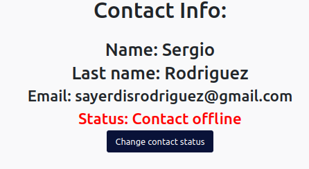
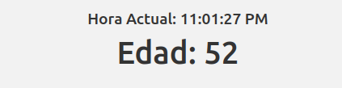
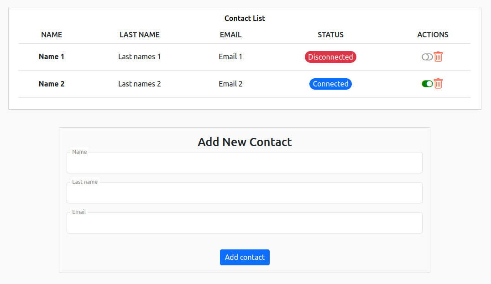
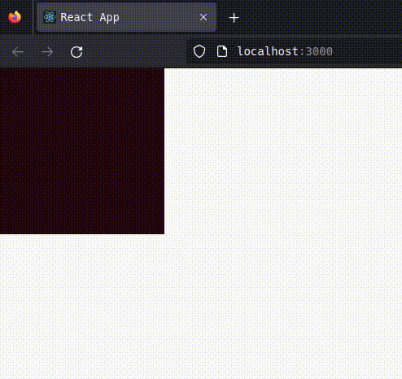
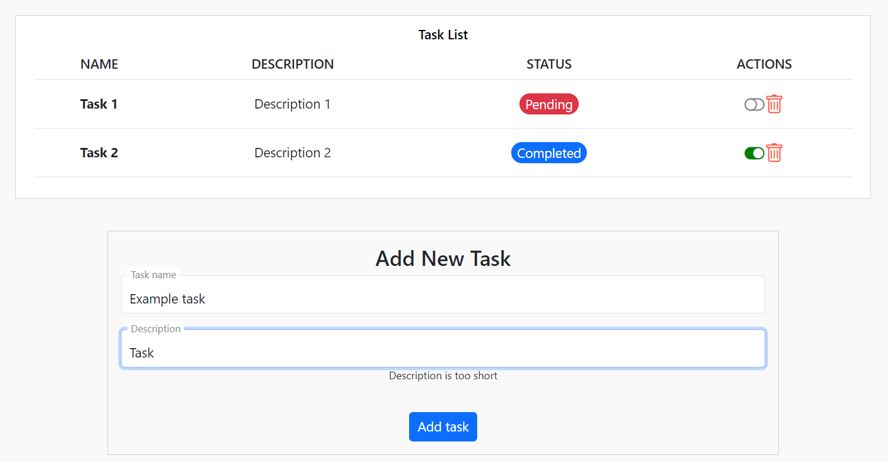

# Proposed exercises repository for OpenBootCamp React Course

In this repository, I upload the solutions to the exercises proposed by the OpenBootCamp React course. Additionally, I include exercise descriptions and screenshots of the solutions.

<p align="center">
  
</p>

## Table of Contents

- [Exercises 1, 2, and 3: PropTypes and useState](#exercises-1-2-and-3-proptypes-and-usestate)
- [Exercises 4, 5, and 6: Converting Class Component to Functional Component](#exercises-4-5-and-6-converting-class-component-to-functional-component)
- [Exercises 7, 8, and 9: Contact List in React JS](#exercises-7-8-and-9-contact-list-in-react-js)
- [Exercises 10, 11, and 12: Changing Color on Mouse Events](#exercises-10-11-and-12-changing-color-on-mouse-events)
- [Exercises 13, 14, and 15: Task List and Form using Formik and Yup libraries](#exercises-13-14-and-15-task-list-and-form-using-formik-and-yup-libraries)
- [Upcoming Exercises (🚀)](#upcoming-exercises-)

## Exercises 1, 2, and 3: PropTypes and useState

**Exercise Explanation and Requirements:**

In this first React programming challenge, we will put into practice what we have learned so far by creating two components: Component A and Component B.

#### Component A

Component A represents a Contact and has the following features:

- **Name**: A string representing the contact's name.
- **Last Name**: A string representing the contact's last name.
- **Email**: A string representing the contact's email.
- **Connected**: A boolean indicating whether the contact is connected or not.

#### Component B

On the other hand, we have Component B, which receives a contact as a prop and can toggle its connected state between connected and disconnected.

- If the contact is connected, it should display: "Contact Online".
- If the contact is disconnected, it should display: "Contact Unavailable".

#### Rendering Components in the Solution

- Component A should be rendered inside the `App.js` component of the project.
- Component B should be rendered from Component A and receive props correctly.

Remember to use PropTypes properly to validate the types of props received by the components.

### Exercise Screenshot:



_Code can be found in the repository, in its respective folder or branch or click here: [Solution](https://github.com/SJAR03/ejercicios-react/tree/main/src/Exercise-1-2-3)._

## Exercises 4, 5, and 6: Converting Class Component to Functional Component

**Exercise Explanation and Requirements:**

Given the following class component that includes several lifecycle methods, we need to convert it into a functional component that performs the same functionality.

```jsx
import React, { Component } from 'react';
import '../../styles/clock.scss';

class Clock extends Component {
  constructor(props) {
    super(props);
    // Component's private state
    this.state = {
      // Generate initial date as component's state
      date: new Date(),
      age: 0,
      name: 'Martin',
      lastName: 'San Jose',
    };
  }

  componentDidMount() {
    this.timerID = setInterval(() => this.tick(), 1000);
  }

  componentWillUnmount() {
    clearInterval(this.timerID);
  }

  render() {
    return (
      <div>
        <h2>Current Time: {this.state.date.toLocaleTimeString()}</h2>
        <h3>
          {this.state.name} {this.state.lastName}
        </h3>
        <h1>Age: {this.state.age}</h1>
      </div>
    );
  }

  tick() {
    this.setState((prevState) => {
      let age = prevState.age + 1;
      return {
        ...prevState,
        date: new Date(),
        age,
      };
    });
  }
}

export default Clock;
```

### Exercise Screenshot:



_The code can be found in the repository, in its respective folder or branch or click here: [Solution](https://github.com/SJAR03/ejercicios-react/tree/main/src/Exercise-4-5-6).._

## Exercises 7, 8, and 9: Contact List in React JS

**Exercise Description and Requirements:**

In this React JS exercise, you are asked to create a contact list with the following functionalities:

##### Display Contact

The list should display existing contacts, including their information such as name, last name, email, and connection status.

##### Create Contact

You should implement the functionality to add new contacts to the list. Each contact should have a name, last name, email, and initial connection status.

##### Delete Contact

There should be an option to delete existing contacts from the list. When a contact is deleted, it should disappear from the view.

##### Change Contact Status

Each contact should have a connection status that can be changed between "Connected" and "Disconnected". There should be a way to change this status for each contact individually.

### Exercise Screenshot:



_The code can be found in the repository, in its respective folder or branch or click here: [Solution](https://github.com/SJAR03/ejercicios-react/tree/main/src/Exercise-7-8-9).._

## Exercises 10, 11, and 12: Changing Color on Mouse Events

**Exercise Description and Requirements:**

In this exercise, you will create a component that contains an element, such as a rectangle or a square.

The dimensions of the element should be 255px width and 255px height, and its initial color should be black.

**Inside the component, you will implement several mouse event handlers that will change the color of the element:**

- A method that changes the color of the component to a random RGB value (between 0 and 255) when the mouse enters the container.
- A method that stops the color change completely when the mouse leaves the component.
- Finally, a method that stops the color change when the component is double-clicked.

### Exercise Screenshot:



_The code can be found in the repository, in its respective folder or branch or click here: [Solution](https://github.com/SJAR03/ejercicios-react/tree/main/src/Exercise-10-11-12).._

## Exercises 13, 14, and 15: Task List and Form using Formik and Yup libraries

**Exercise Description and Requirements:**

Starting from the final project, you must create a form to create tasks. To do this you will use:

- **Formik for the form.**
- **Yup for the validations.**

### Exercise Screenshot:



_The code can be found in the repository, in its respective folder or branch or click here: [Solution](https://github.com/SJAR03/ejercicios-react/tree/exercises-13-14-15).._

## Upcoming Exercises (🚀)

The fun doesn't end here! There are still many more exercises on the way that I hope to solve as I continue progressing in the course.

🚧 Work in progress 🚧
